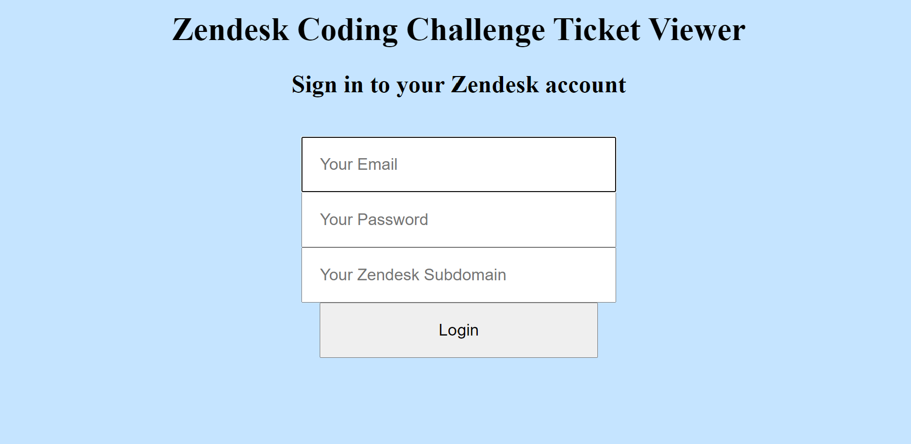
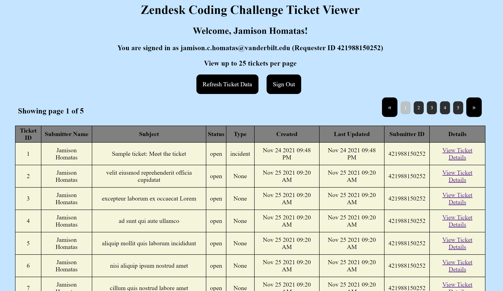
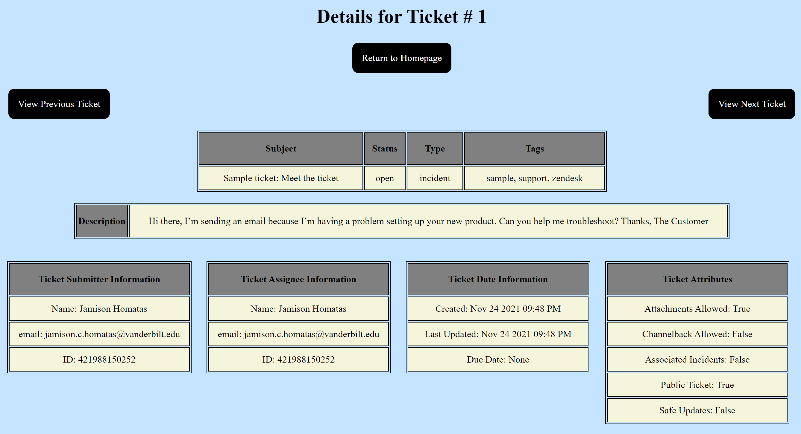

# Zendesk Coding Challenge
## Installation Instructions:
#### Navigate to the desired download directory in your terminal/shell.
#### Download the repository with
```git clone https://github.com/jhomatas48/Zendesk-Coding-Challenge.git```

#### Install dependencies using
```pip install -r requirements.txt```

#### Run main.py to launch the ticket viewer.
#### The output will contain a link to the ticket viewer which is ```http://127.0.0.1:5000/``` by default.

## Usage Instructions:
### Login Page:
#### Click this link and you will be redirected to the following login page:


### Home Page:
#### Enter in your Zendesk account email, password, and Zendesk subdomain and login.
#### You will now be redirected to the following ticket viewer page:


#### You are given option to refresh the data at an point using the ```Refresh Ticket Data``` button.
#### You may also sign out by pressing the ```Sign Out``` button which will redirect you to the login page.
#### Navigate the pages of ticket data by clicking on the arrows and page number buttons on the right side of the screen.

### Single-View:
#### Every ticket entry contains a link to view the ticket's details in single-view format:

#### This contains more specific information about each ticket.
#### You may alo navigate to adjacent ticket entries while in single-view mode and can return home at any point.

## Unit Testing Information:
#### These unit tests first cover retriving the ticket information from the Zendesk API and formatting the data properly.
#### The tests also cover the user interface and check that the functions work, the data is stored properly, and errors are handled correctly.
#### In order to check these unit tests, you must enter in your Zendesk email, password, subdomain, and your full name into the specified fields of the file 
#### ```credentials.py``` in the ```tests``` folder.

### Testing Instructions:
#### In your terminal, navigate to the tests directory of the project. Then run the command ```pytest``` to see test results or run ```pytest -vv``` to see the full testing details.

## Additional Details & Final Thoughts:
#### I would have liked to optimize my approach for this if given more time. While the ticket viewer updates quickly for small data, it may not scale very well to larger data. I had a very fun time on this project and learned a lot in the process!
#### Hope you enjoy my Zendesk ticket viewer!

